# 📊 ProCSV Analytics Dashboard

A sophisticated, full-stack CSV analytics platform built with **Next.js 15**, **TypeScript**, and **Tailwind CSS**. This dashboard provides automated schema inference, dynamic visualization generation, and a robust file management system for managing datasets.

---

## 🏗️ System Architecture & Data Flow

The following diagram illustrates the lifecycle of a CSV file from upload to visualization:

```mermaid
graph TD
    A[📂 User CSV File] -->|Upload via multipart/form-data| B(🚀 Next.js API Routes)
    B -->|File I/O| C{💾 Local Data Storage}
    C -->|Read Stream| D[🧠 Schema Inference Engine]
    D -->|Infer Types: string, number, date| E[📄 JSON Schema Response]
    E -->|Frontend State| F[🎨 Dynamic UI Components]
    F -->|Filter Operations| G[📊 Recharts Visualization]
    F -->|Pagination/Sorting| H[📋 Advanced Data Table]
    G & H -->|User Interaction| I[🔄 Real-time Update Loop]
```



---

## 🚀 Key Technical Features

### 1. Intelligent Schema Inference
The core engine utilizes `papaparse` for high-performance parsing and a custom inference layer that:
- Detects data types based on content sampling.
- Maps detected types to specialized frontend controls (Range Sliders for Numbers, Date Pickers for Dates).
- Generates distinct value sets for multi-select categorical filters.

### 2. Dynamic Visualization System
- **Recharts Integration**: Supports Bar, Line, Area, Pie, Radar, and Radial charts.
- **Full-Screen Mode**: A dedicated overlay system for granular deep-dives into specific charts.
- **Live Axis Switching**: Dynamically re-renders visualizations when users toggle between schema attributes.

### 3. Professional File Management
- **Tree-based Navigation**: Recursive file system traversal for organizing datasets.
- **Full CRUD**: API-driven folder creation, renaming, and atomic deletions.
- **Smart Routing**: Seamless state management ensuring the UI remains synchronized with the file system state.

### 4. Enterprise-Grade UI/UX
- **Theming**: Full Dark/Light/System theme support via `next-themes`.
- **Responsiveness**: Mobile-first architecture with adaptive sidebars and scrollable data containers.
- **Aesthetics**: Glassmorphism effects, backdrop blurs, and premium typography (Geist Sans).

---

## 🛠️ Installation & Setup

### Prerequisites
- Node.js 18.x or higher
- pnpm (recommended) or npm/yarn

### 1. Clone & Install
```bash
git clone <repository-url>
cd salesdashboard
pnpm install
```

### 2. Development Environment
Runs the application with Hot Module Replacement (HMR) for rapid development.
```bash
pnpm dev
```
Accessible at: `http://localhost:3000`

### 3. Production Deployment
Optimizes the application for performance and stability.

**Build the distribution:**
```bash
pnpm build
```

**Start the production server:**
```bash
pnpm start
```

---

## 📂 Project Structure

- `/app`: Next.js App Router (Pages & API Routes).
- `/components`: Radix-UI based atomic components and dashboard features.
- `/lib`: Server-side file system helpers and CSV processing logic.
- `/data`: Default directory for local CSV storage (gitignored by default).
- `/types`: Comprehensive TypeScript definitions for schemas and data rows.

---

## 🛡️ Security & Performance
- **Path Sanitization**: Prevents directory traversal during file operations.
- **Hydration Safety**: Uses Suspense boundaries for search-parameter dependent components.
- **Performance**: Optimized re-renders using `useMemo` for heavy data filtering logic.

---

## 🔮 Roadmap
- 📈 **Advanced Aggregations**: Pivot tables and multi-column group-bys.
- 💾 **Persistence**: Save specific chart configurations per file in localized storage.
- 🧪 **E2E Testing**: Comprehensive Playwright suites for data integrity verification.

**Developed with precision by Antigravity.**
